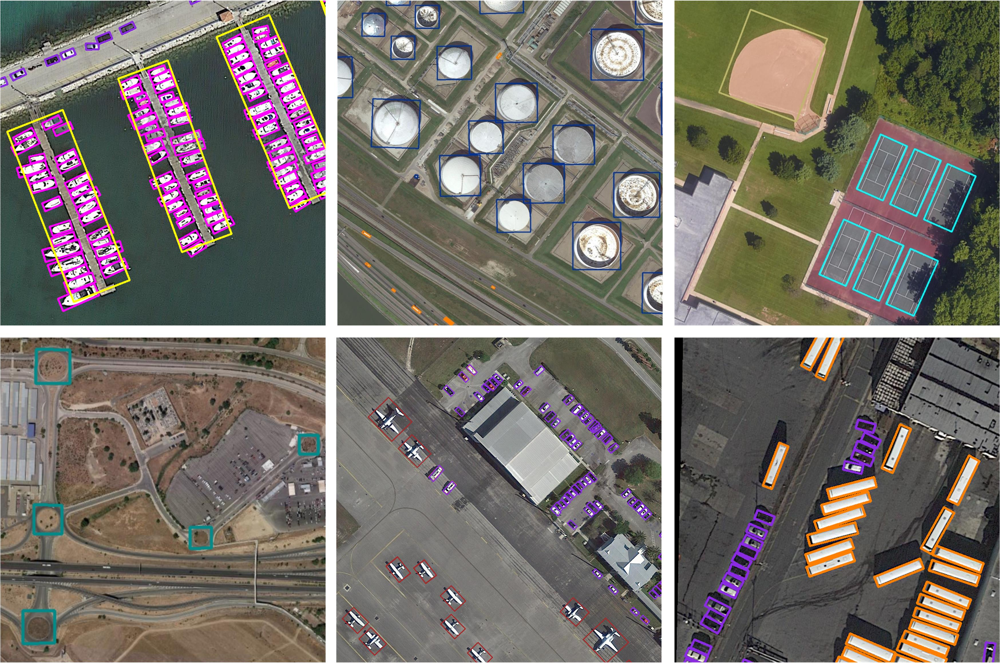

# OBBDetection

**note**: If you have questions or good suggestions, feel free to propose issues and contact me.

## introduction

OBBDetection is an oriented object detection toolbox modified from [MMdetection v2.2](https://github.com/open-mmlab/mmdetection).



### Major features

- **MMdetection feature inheritance**

  OBBDetection doesn't change the structure and codes of original MMdetection and the additive codes are under MMdetection logic. Therefore, our OBBDetection inherits all features from MMdetection.

- **Support of multiple frameworks out of box**

  We implement multiple oriented object detectors in this toolbox (*e.g.* RoI Transformer, Gliding Vertex). Attributing to moudlar design of MMdetection, Many parts of detectors (*e.g.* backbone, RPN, sampler and assigner) have multiple options.

- **Flexible representation of oriented boxes**

  Horizontal bounding boxes (HBB), oriented bounding boxes (OBB) and 4 point boxes (POLY) are supported in this toolbox. The program will confirm the type of bounding box by the tensor shape or the default setting.

We develop [BboxToolkit](https://github.com/jbwang1997/BboxToolkit) to support oriented bounding boxes operations, which is heavily depended on by this toolbox.

## License

This project is released under the [Apache 2.0 license](LICENSE).

## Update

- (**2021-09-18**) Implement [Double Head OBB](configs/obb/double_heads_obb) in the OBBDetection.
- (**2021-09-01**) Implement [FCOS OBB](configs/obb/fcos_obb) in the OBBDetection.
- (**2021-08-21**) Reimplement the [PolyIoULoss](configs/obb/poly_iou_loss).

## Benchmark and model zoo

Results and models are available in the [model zoo](docs/model_zoo.md).

Supported backbones:
- [x] ResNet
- [x] ResNeXt
- [x] VGG
- [x] HRNet
- [x] RegNet
- [x] Res2Net

Supported oriented detection methods:
- [x] [Oriented R-CNN (ICCV'2021)](configs/obb/oriented_rcnn)
- [x] [Poly IoU Loss](configs/obb/poly_iou_loss)
- [x] [Faster R-CNN OBB](configs/obb/faster_rcnn_obb)
- [x] [Double Head OBB](configs/obb/double_heads_obb)
- [x] [RetinaNet OBB](configs/obb/retinanet_obb)
- [x] [Gliding Vertex](configs/obb/gliding_vertex)
- [x] [RoI Transformer](configs/obb/roi_transformer)
- [x] [FCOS OBB](configs/obb/fcos_obb)

Supported horizontal detection methods:
- [x] [RPN](configs/rpn)
- [x] [Fast R-CNN](configs/fast_rcnn)
- [x] [Faster R-CNN](configs/faster_rcnn)
- [x] [Mask R-CNN](configs/mask_rcnn)
- [x] [Cascade R-CNN](configs/cascade_rcnn)
- [x] [Cascade Mask R-CNN](configs/cascade_rcnn)
- [x] [SSD](configs/ssd)
- [x] [RetinaNet](configs/retinanet)
- [x] [GHM](configs/ghm)
- [x] [Mask Scoring R-CNN](configs/ms_rcnn)
- [x] [Double-Head R-CNN](configs/double_heads)
- [x] [Hybrid Task Cascade](configs/htc)
- [x] [Libra R-CNN](configs/libra_rcnn)
- [x] [Guided Anchoring](configs/guided_anchoring)
- [x] [FCOS](configs/fcos)
- [x] [RepPoints](configs/reppoints)
- [x] [Foveabox](configs/foveabox)
- [x] [FreeAnchor](configs/free_anchor)
- [x] [NAS-FPN](configs/nas_fpn)
- [x] [ATSS](configs/atss)
- [x] [FSAF](configs/fsaf)
- [x] [PAFPN](configs/pafpn)
- [x] [Dynamic R-CNN](configs/dynamic_rcnn)
- [x] [PointRend](configs/point_rend)
- [x] [CARAFE](configs/carafe/README.md)
- [x] [DCNv2](configs/dcn/README.md)
- [x] [Group Normalization](configs/gn/README.md)
- [x] [Weight Standardization](configs/gn+ws/README.md)
- [x] [OHEM](configs/faster_rcnn/faster_rcnn_r50_fpn_ohem_1x_coco.py)
- [x] [Soft-NMS](configs/faster_rcnn/faster_rcnn_r50_fpn_soft_nms_1x_coco.py)
- [x] [Generalized Attention](configs/empirical_attention/README.md)
- [x] [GCNet](configs/gcnet/README.md)
- [x] [Mixed Precision (FP16) Training](configs/fp16/README.md)
- [x] [InstaBoost](configs/instaboost/README.md)
- [x] [GRoIE](configs/groie/README.md)
- [x] [DetectoRS](configs/detectors/README.md)
- [x] [Generalized Focal Loss](configs/gfl/README.md)

## Installation

Please refer to [install.md](docs/install.md) for installation and dataset preparation.

## Get Started

### Oriented models training and testing

If you want to train or test a oriented model, please refer to [oriented_model_starting.md](docs/oriented_model_starting.md).

### How to use MMDetection

If you are not familiar with MMdetection, please see [getting_started.md](docs/getting_started.md) for the basic usage of MMDetection. There are also tutorials for [finetuning models](docs/tutorials/finetune.md), [adding new dataset](docs/tutorials/new_dataset.md), [designing data pipeline](docs/tutorials/data_pipeline.md), and [adding new modules](docs/tutorials/new_modules.md).

## Acknowledgement

We refered [S2ANet](https://github.com/csuhan/s2anet) and [AerialDetection](https://github.com/dingjiansw101/AerialDetection) when develping OBBDetection.

This toolbox is modified from [MMdetection](https://github.com/open-mmlab/mmdetection). If you use this toolbox or benchmark in your research, please cite the following information.

```
@article{mmdetection,
  title   = {{MMDetection}: Open MMLab Detection Toolbox and Benchmark},
  author  = {Chen, Kai and Wang, Jiaqi and Pang, Jiangmiao and Cao, Yuhang and
             Xiong, Yu and Li, Xiaoxiao and Sun, Shuyang and Feng, Wansen and
             Liu, Ziwei and Xu, Jiarui and Zhang, Zheng and Cheng, Dazhi and
             Zhu, Chenchen and Cheng, Tianheng and Zhao, Qijie and Li, Buyu and
             Lu, Xin and Zhu, Rui and Wu, Yue and Dai, Jifeng and Wang, Jingdong
             and Shi, Jianping and Ouyang, Wanli and Loy, Chen Change and Lin, Dahua},
  journal = {arXiv preprint arXiv:1906.07155},
  year={2019}
}
```

This is the official implement of [Oriented R-CNN](configs/obb/oriented_rcnn). if it is used in your research, please cite the following information.

```
@InProceedings{Xie_2021_ICCV,
  author = {Xie, Xingxing and Cheng, Gong and Wang, Jiabao and Yao, Xiwen and Han, Junwei},
  title = {Oriented R-CNN for Object Detection},
  booktitle = {Proceedings of the IEEE/CVF International Conference on Computer Vision (ICCV)},
  month = {October},
  year = {2021},
  pages = {3520-3529} }
```
