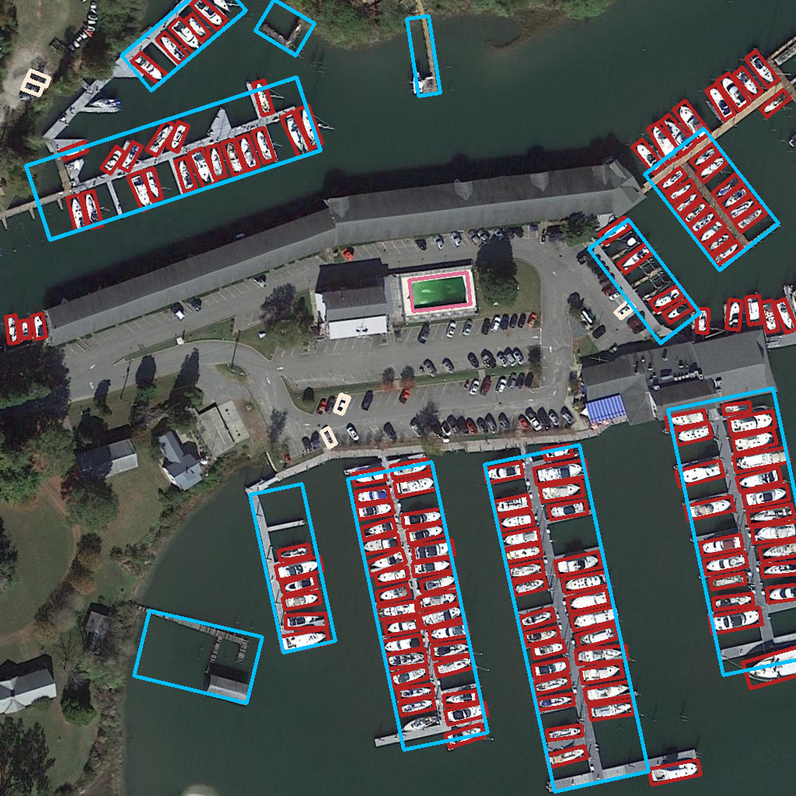

# OBBMMDetection

**news**: we are updating OBBMMDetection based on newly MMDetection2.9. MMDetection2.9 supports more advanced models which will help to develop oriented object detection.

## introduction
OBBMMDetection is a open source oriented object detection Toolbox based on the original MMDetection.
Oriented object detection is a challenging task using in aerial images.



We put all extra codes in **obb** folders, so the structure of MMDetection doesn't change.
It's easy to use if you are familiar with MMDetection.

### Major features

- **High efficiency**

  OBBMMdetection is based on MMdetection2.2. All bboxes operations run on GPUs. Oriented box angle calculates in multiprocessing dataloader. the speed and performance of train and test are better than [AerialDetection](https://github.com/dingjiansw101/AerialDetection)

- **Multiple box forms**

  OBBMMDetection supports three types of boxes, including HBB(horizontal boxes), (oritend boxes), and POLY(polygon boxes).
  it's more flexible to develop model in OBBMMDeteciton.

- **Ease of train and test**
  
  OBBMMDetection supports most aerial image detection datasets, including DOTA, DIOR, and HRSC.
  We reimplemented image splitting and implemented online result merging for DOTA, so it's easier to DOTA train and test.

## License

This project is released under the [Apache 2.0 license](LICENSE).

## Benchmark and model zoo

Results and models are available in the [model zoo](docs/model_zoo.md).

OBB results and models are available in the[obb_model_zoo](docs/obb_model_zoo.md)

Supported backbones:
- [x] ResNet
- [x] ResNeXt
- [x] VGG
- [x] HRNet
- [x] RegNet
- [x] Res2Net

Supported obb methods:
- [x] RPN OBB
- [x] [Faster R-CNN OBB](configs/obb/faster_rcnn_obb)
- [x] [RetinaNet OBB](configs/obb/retinanet_obb)
- [x] [Gliding Vertex](configs/obb/gliding_vertex)
- [x] [RoI Transformer](configs/obb/roi_transformer)
- [x] [Oriented R-CNN](configs/obb/sp_orpn)
- [x] [AOG RPN](cofings/obb/aog_rpn)

Supported hbb methods:
- [x] [RPN](configs/rpn)
- [x] [Fast R-CNN](configs/fast_rcnn)
- [x] [Faster R-CNN](configs/faster_rcnn)
- [x] [Mask R-CNN](configs/mask_rcnn)
- [x] [Cascade R-CNN](configs/cascade_rcnn)
- [x] [Cascade Mask R-CNN](configs/cascade_rcnn)
- [x] [SSD](configs/ssd)
- [x] [RetinaNet](configs/retinanet)
- [x] [GHM](configs/ghm)
- [x] [Mask Scoring R-CNN](configs/ms_rcnn)
- [x] [Double-Head R-CNN](configs/double_heads)
- [x] [Hybrid Task Cascade](configs/htc)
- [x] [Libra R-CNN](configs/libra_rcnn)
- [x] [Guided Anchoring](configs/guided_anchoring)
- [x] [FCOS](configs/fcos)
- [x] [RepPoints](configs/reppoints)
- [x] [Foveabox](configs/foveabox)
- [x] [FreeAnchor](configs/free_anchor)
- [x] [NAS-FPN](configs/nas_fpn)
- [x] [ATSS](configs/atss)
- [x] [FSAF](configs/fsaf)
- [x] [PAFPN](configs/pafpn)
- [x] [Dynamic R-CNN](configs/dynamic_rcnn)
- [x] [PointRend](configs/point_rend)
- [x] [CARAFE](configs/carafe/README.md)
- [x] [DCNv2](configs/dcn/README.md)
- [x] [Group Normalization](configs/gn/README.md)
- [x] [Weight Standardization](configs/gn+ws/README.md)
- [x] [OHEM](configs/faster_rcnn/faster_rcnn_r50_fpn_ohem_1x_coco.py)
- [x] [Soft-NMS](configs/faster_rcnn/faster_rcnn_r50_fpn_soft_nms_1x_coco.py)
- [x] [Generalized Attention](configs/empirical_attention/README.md)
- [x] [GCNet](configs/gcnet/README.md)
- [x] [Mixed Precision (FP16) Training](configs/fp16/README.md)
- [x] [InstaBoost](configs/instaboost/README.md)
- [x] [GRoIE](configs/groie/README.md)
- [x] [DetectoRS](configs/detectors/README.md)
- [x] [Generalized Focal Loss](configs/gfl/README.md)

## Installation

Install BboxToolkit first.

Please refer to [install.md](docs/install.md) for installation and dataset preparation.

## Get Started


### How to use MMDetection

Please see [getting_started.md](docs/getting_started.md) for the basic usage of MMDetection. There are also tutorials for [finetuning models](docs/tutorials/finetune.md), [adding new dataset](docs/tutorials/new_dataset.md), [designing data pipeline](docs/tutorials/data_pipeline.md), and [adding new modules](docs/tutorials/new_modules.md).

## Citation

If you use this toolbox or benchmark in your research, please cite this project.

```
@article{mmdetection,
  title   = {{MMDetection}: Open MMLab Detection Toolbox and Benchmark},
  author  = {Chen, Kai and Wang, Jiaqi and Pang, Jiangmiao and Cao, Yuhang and
             Xiong, Yu and Li, Xiaoxiao and Sun, Shuyang and Feng, Wansen and
             Liu, Ziwei and Xu, Jiarui and Zhang, Zheng and Cheng, Dazhi and
             Zhu, Chenchen and Cheng, Tianheng and Zhao, Qijie and Li, Buyu and
             Lu, Xin and Zhu, Rui and Wu, Yue and Dai, Jifeng and Wang, Jingdong
             and Shi, Jianping and Ouyang, Wanli and Loy, Chen Change and Lin, Dahua},
  journal= {arXiv preprint arXiv:1906.07155},
  year={2019}
}
```