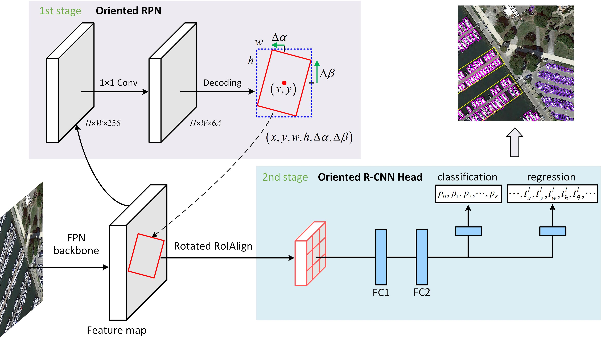

# [Oriented R-CNN for Object Detection](https://arxiv.org/abs/2108.05699v1)

> Xingxiing Xie, Gong Cheng, Jiabao Wang, Xiwen Yao, Junwei Han
> arxiv preprint ([arXiv:2108.05699](https://arxiv.org/abs/2108.05699v1))

## Introduction



Current state-of-the-art two-stage detectors generate oriented proposals through time-consuming schemes.
This diminishes the detectors’ speed, thereby becoming the computational bottleneck in advanced oriented object detection systems.
This work proposes an effective and simple oriented object detection framework, termed Oriented R-CNN, which is a general two-stage oriented detector with promising accuracy and efficiency.
To be specific, in the first stage, we propose an oriented Region Proposal Network (oriented RPN) that directly generates high-quality oriented proposals in a nearly cost-free manner.
The second stage is oriented R-CNN head for refining oriented Regions of Interest (oriented RoIs) and recognizing them.

## Results and models

**note**: The **ms** means multiple scale image split and the **rr** means random rotation.

### DOTA dataset

| Backbone | Lr schd | ms | rr | box AP |                           Baidu Yun                          |                                    Google Drive                                    |
|:--------:|:-------:|:--:|:--:|:------:|:------------------------------------------------------------:|:----------------------------------------------------------------------------------:|
|  R50-FPN |    1x   |  - |  - |  75.87 | [key: v4s0](https://pan.baidu.com/s/1OQtoPBi36zVwCk_jXmzbBw) | https://drive.google.com/file/d/1Rv5sctUcnEDSGZhMxgXVZ-7dMai0qrIr/view?usp=sharing |
| R101-FPN |    1x   |  - |  - |  76.28 | [key: zge9](https://pan.baidu.com/s/1M8VQo1CEhF-arFo2-Q_3uQ) | https://drive.google.com/file/d/1Sz6CLjeCMAR06B1NfkbWnVX2FZuMCR8u/view?usp=sharing |
|  R50-FPN |    1x   |  √ |  √ |  80.87 | [key: 66jf](https://pan.baidu.com/s/1d86ZqPQCSdoeXiQ38fvSyQ) | https://drive.google.com/file/d/1tZjPOOioYtZKA3C1z6Twjcf__5NYvVOr/view?usp=sharing |
| R101-FPN |    1x   |  √ |  √ |  80.52 | [key: o1r6](https://pan.baidu.com/s/1zUF4I09BjW8_pniy71cvtg) | https://drive.google.com/file/d/1JG3V34PYiwZ3NM7KSLu9MRUPCO-RZOX5/view?usp=sharing |

### HRSC2016 dataset

| Backbone | Lr schd | ms | rr | box AP |                           Baidu Yun                          |                                    Google Drive                                    |
|:--------:|:-------:|:--:|:--:|:------:|:------------------------------------------------------------:|:----------------------------------------------------------------------------------:|
|  R50-FPN |    3x   |  - |  - |  90.4  | [key: 02zc](https://pan.baidu.com/s/1ISxj1HTumqhD-tjwMYcRhg) | https://drive.google.com/file/d/1K_RvwPMtDl_amR_lMxeiXzVSwNFchPHc/view?usp=sharing |
| R101-FPN |    3x   |  - |  - |  90.5  | [key: q3e6](https://pan.baidu.com/s/19x1doXr2qqy7OOTAMKzazA) | https://drive.google.com/file/d/1SZhO4HWzstjbzI3SEwGun2byM3y4p9Bc/view?usp=sharing |

## Citation

```
@article{xie2021oriented,
	title={Oriented R-CNN for Object Detection}, 
	author={Xingxing Xie and Gong Cheng and Jiabao Wang and Xiwen Yao and Junwei Han},
	journal={arXiv preprint arXiv:2108.05699},
	year={2021},
}
```
